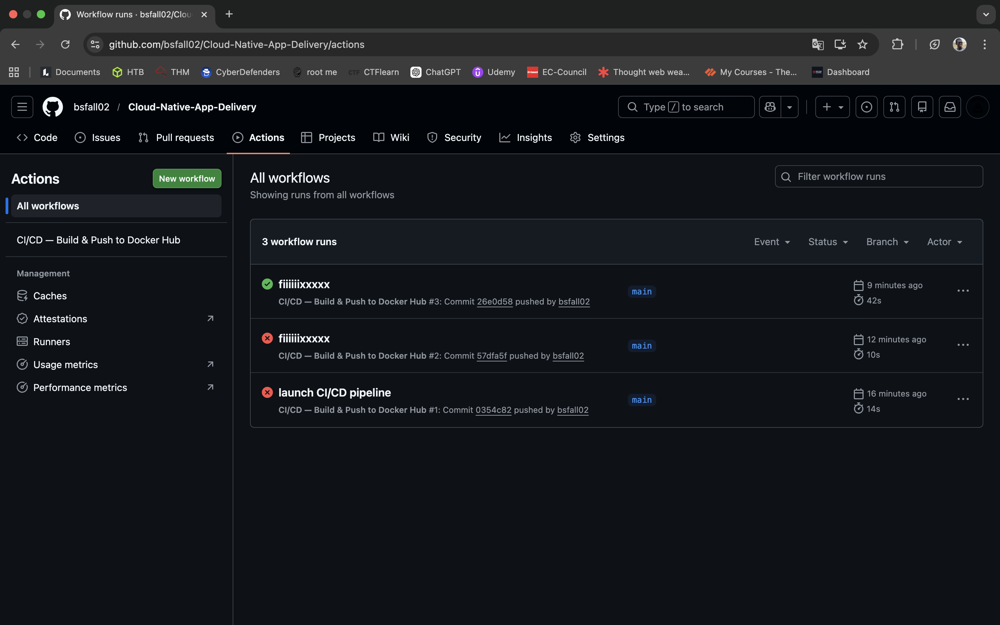
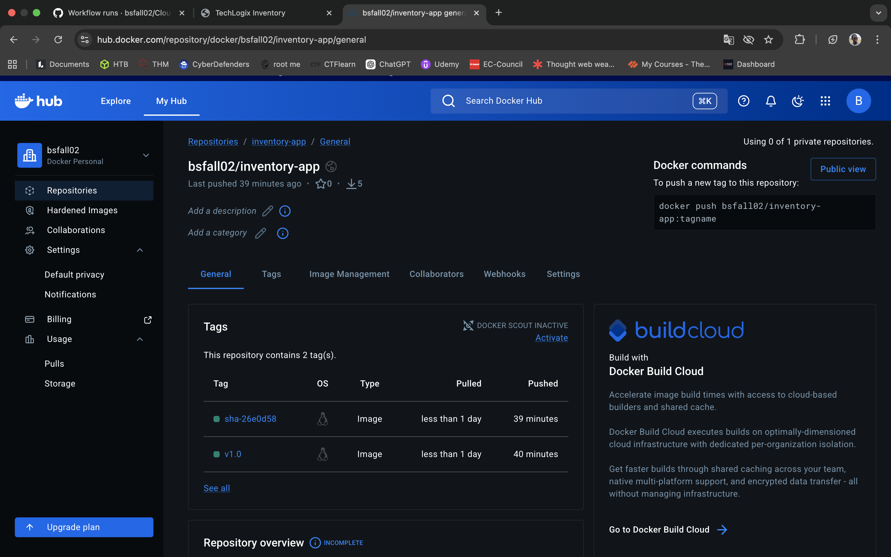
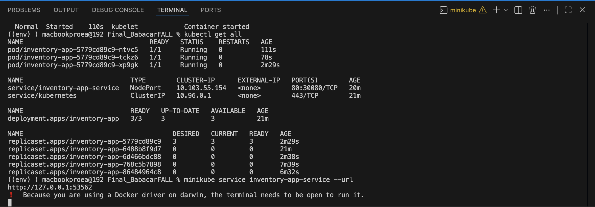
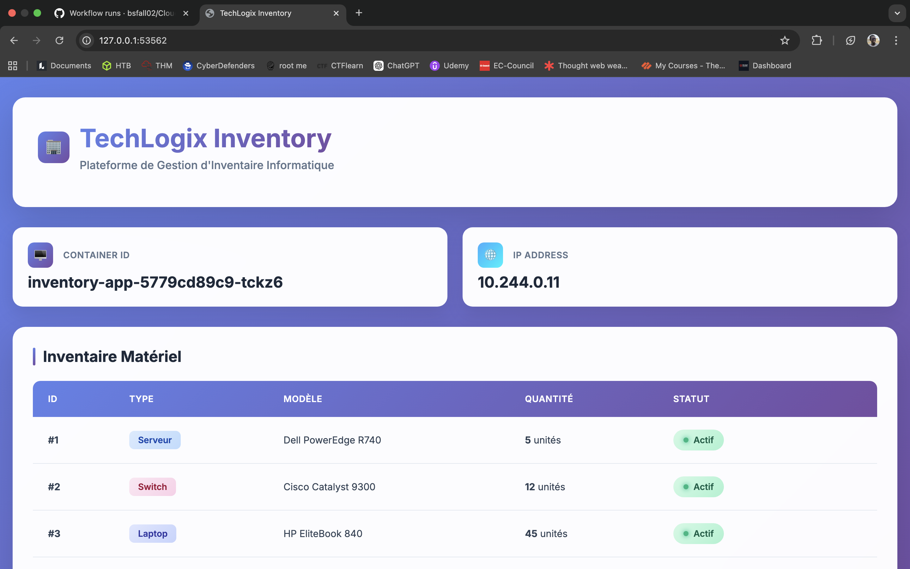

# 🚀 Cloud-Native App Delivery — Inventory App

> Projet final DevOps — TechLogix | Déploiement cloud-native d'une application Spring Boot via Docker, GitHub Actions et Kubernetes.

---

## 📁 Structure du dépôt

```
.
├── app/                        # Code source Spring Boot
├── .github/
│   └── workflows/
│       └── ci-cd.yml           # Pipeline GitHub Actions
├── k8s/
│   ├── Deployment.yaml         # Déploiement Kubernetes (3 réplicas)
│   └── Service.yaml            # Service NodePort
├── Dockerfile                  # Image multi-stage optimisée
└── README.md
```

---

## 🐳 Phase 1 — Conteneurisation Docker

### Lancer l'application en local

**Pré-requis :** Docker installé sur votre machine.

```bash
# 1. Cloner le dépôt
git clone https://github.com/bsfall02/Cloud-Native-App-Delivery.git
cd Cloud-Native-App-Delivery

# 2. Construire l'image Docker
docker build -t inventory-app:local .

# 3. Lancer le container
docker run -d -p 3000:3000 --name inventory-app inventory-app:local

# 4. Vérifier que l'application répond
curl http://localhost:3000
```

L'application est accessible sur : **http://localhost:3000**

Pour arrêter le container :
```bash
docker stop inventory-app && docker rm inventory-app
```

### Optimisations du Dockerfile
- **Multi-stage build** : l'image finale ne contient que le JRE (pas le JDK/Maven), ce qui réduit significativement la taille.
- **Image Alpine** : base légère (`eclipse-temurin:17-jre-alpine`).
- **Cache des dépendances Maven** : le `pom.xml` est copié avant le code source pour éviter de re-télécharger les dépendances à chaque build.
- **Utilisateur non-root** : sécurité renforcée avec un utilisateur dédié `appuser`.

---

## ⚙️ Phase 2 — Pipeline CI/CD (GitHub Actions)

### Configuration

Le pipeline se déclenche automatiquement à chaque `git push` sur la branche `main`.

#### Secrets GitHub à configurer

Dans votre dépôt GitHub → **Settings → Secrets and variables → Actions** :

| Nom du secret | Description |
|---|---|
| `DOCKERHUB_USERNAME` | Votre nom d'utilisateur Docker Hub |
| `DOCKERHUB_TOKEN` | Token d'accès Docker Hub (pas votre mot de passe) |

> Pour créer un token Docker Hub : https://hub.docker.com/settings/security

#### Étapes du pipeline

```
git push → main
    │
    ├─ 1. Checkout du code
    ├─ 2. Setup JDK 17
    ├─ 3. Exécution des tests Maven
    ├─ 4. Login Docker Hub (via secrets)
    ├─ 5. Build de l'image Docker
    └─ 6. Push sur Docker Hub avec tag v1.0
```

### Visualiser le pipeline

Rendez-vous sur : `https://github.com/bsfall02/Cloud-Native-App-Delivery/actions`

---

> ✅ **Capture CI/CD — Pipeline réussi (tout en vert)**
>
> 

---

> ✅ **Capture Docker Hub — Image avec tag v1.0**
>
> 

---

## ☸️ Phase 3 — Orchestration Kubernetes

### Pré-requis

- Minikube, K3s ou un cluster cloud (GKE, EKS, AKS)
- `kubectl` configuré et connecté au cluster

### Déploiement

```bash
# 1. (Si Minikube) Démarrer le cluster
minikube start

# 2. Appliquer les manifestes Kubernetes
kubectl apply -f k8s/Deployment.yaml
kubectl apply -f k8s/Service.yaml

# 3. Vérifier l'état du déploiement
kubectl get all

# 4. Vérifier les pods en détail
kubectl get pods -o wide

# 5. Voir les logs d'un pod
kubectl logs -l app=inventory-app --tail=50
```

### Accéder à l'application

**Avec Minikube :**
```bash
minikube service inventory-app-service --url
```

**Avec K3s ou un cluster standard :**
```bash
# Récupérer l'IP du nœud
kubectl get nodes -o wide

# L'application est accessible sur :
# http://<NODE_IP>:30080
```

### Commandes de vérification

```bash
# Vue d'ensemble de toutes les ressources
kubectl get all

# Vérifier le Deployment
kubectl describe deployment inventory-app

# Scaler à 5 réplicas (exemple)
kubectl scale deployment inventory-app --replicas=5

# Mettre à jour l'image (rolling update)
kubectl set image deployment/inventory-app inventory-app=<USERNAME>/inventory-app:v2.0
```

---

> ✅ **Capture Kubernetes — `kubectl get all` (Pods et Service actifs)**
>
> 

---

> ✅ **Capture Navigateur — Application affichée via l'IP du cluster**
>
> 

---

## 🛠️ Technologies utilisées

| Outil | Rôle |
|---|---|
| Java 17 + Spring Boot | Framework applicatif |
| Docker (multi-stage) | Conteneurisation |
| GitHub Actions | Pipeline CI/CD |
| Docker Hub | Registre d'images |
| Kubernetes (Minikube/K3s) | Orchestration & déploiement |

---

## 👤 Auteur

Projet réalisé dans le cadre du cours **Cloud-Native App Delivery** — TechLogix.